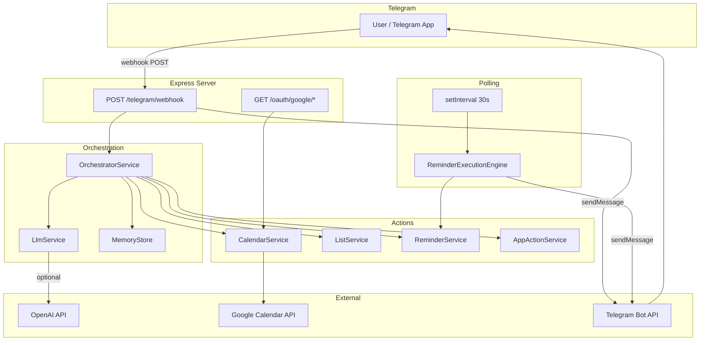
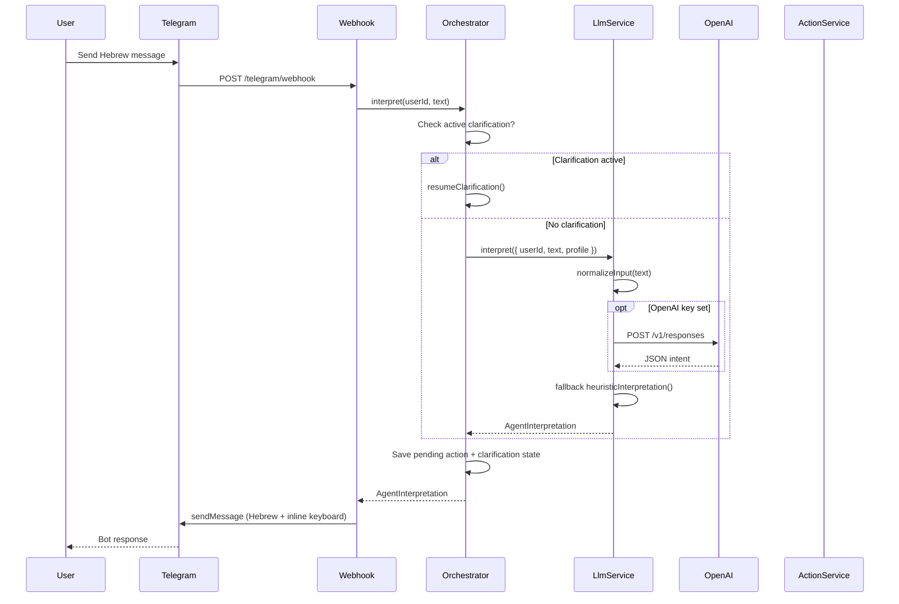
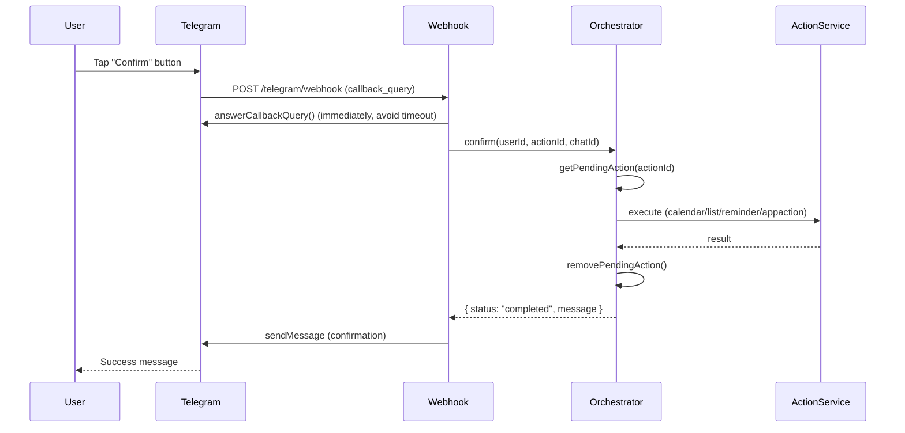
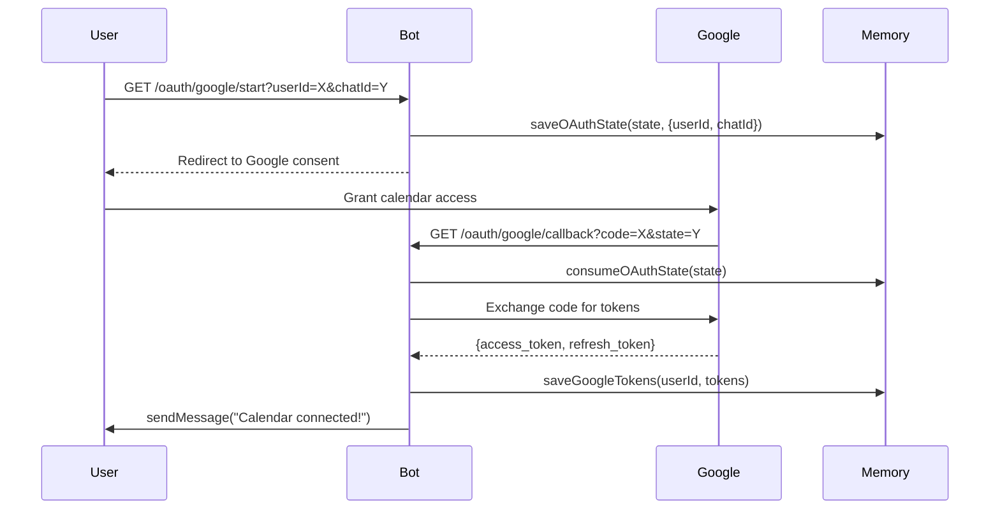

# Codebase Map

> Auto-generated by Cartographer. Last mapped: 2026-04-14T07:50:50Z

## System Overview

A **Hebrew-first personal assistant Telegram bot** that interprets natural-language requests for managing calendar events, shopping/task lists, and reminders. It operates via a webhook-driven Express server, routes intent through a heuristic + OpenAI hybrid engine, and requires explicit user confirmation before executing any side-effectful action.



## Directory Structure

```
Bot/
├── src/
│   ├── services/               # Business logic services
│   │   ├── action-registry.ts          # Registry of external app actions
│   │   ├── app-action-service.ts       # Executes registered app actions via HTTP
│   │   ├── calendar-service.ts         # Google Calendar OAuth2 + CRUD
│   │   ├── database.ts                 # PostgreSQL connection scaffold (unused)
│   │   ├── list-service.ts             # Shopping/task list manager (JSON persistence)
│   │   ├── llm-service.ts              # Intent classification (heuristic + OpenAI)
│   │   ├── memory-store.ts             # In-memory state: profiles, pending actions, tokens
│   │   ├── orchestrator.ts             # Central coordination: clarification state, confirm flow
│   │   ├── reminder-execution-engine.ts# Polling engine for due reminder delivery
│   │   ├── reminder-service.ts         # In-memory reminder CRUD
│   │   ├── telegram-service.ts         # Telegram Bot API wrapper
│   │   └── worklog-service.ts          # Append-only audit log scaffold (unused)
│   ├── utils/
│   │   ├── id.ts                       # Prefixed UUID generator
│   │   ├── logger.ts                   # Structured JSON logger
│   │   ├── normalize.ts                # Input normalization + all regex trigger arrays
│   │   └── time.ts                     # Hebrew/English natural language date parser
│   ├── app.ts                          # createApp() factory — wires all services + routes
│   ├── config.ts                       # Env var loading + Zod validation
│   ├── server.ts                       # Production entry point
│   ├── supported-actions.ts            # Canonical intent/action type constants
│   ├── types.ts                        # All TypeScript domain interfaces
│   └── run-tests.ts                    # Legacy imperative integration test runner
├── docs/
│   └── PROJECT_SPEC_HE.md             # Hebrew product specification
├── Dockerfile                          # Multi-stage Docker build
├── MVP.md                              # English product spec / definition of done
├── TASK.md                             # Claude Code task execution rules
└── WORKLOG.md                          # Chronological dev session log
```

## Module Guide

### Entry Points

**Purpose**: Application startup and HTTP server  
**Key files**:
| File | Purpose | Tokens |
|------|---------|--------|
| `src/server.ts` | Production entry — starts Express on `PORT` | 59 |
| `src/app.ts` | `createApp()` factory — wires all services, mounts routes, starts reminder poll | 5825 |
| `src/config.ts` | Loads + validates all env vars via Zod | 382 |

**Exports**: `createApp()`, `buildTelegramMarkup()`  
**Dependencies**: All services, all utils  
**Gotchas**: `setInterval(30s)` for reminder polling starts inside `createApp()`, not `server.ts` — leaks in tests

---

### Core Domain Types

**Purpose**: Shared type definitions for the entire application  
**Key files**:
| File | Purpose | Tokens |
|------|---------|--------|
| `src/types.ts` | All domain interfaces (User, Calendar, List, Reminder, etc.) | 1051 |
| `src/supported-actions.ts` | Canonical intent/action string constants + derived types | 470 |

**Key Types**:
- `AgentInterpretation` — main response shape returned by the orchestrator
- `ProposedAction<TPayload>` — generic wrapper for any confirmable action
- `ClarificationState` — active multi-turn conversation context per user
- `AgentIntent` — union of all 15 intent strings
- `ProposedActionType` — 13 actionable intent strings (subset, excludes `clarify`/`out_of_scope`)

---

### Orchestration Layer

**Purpose**: Central coordination — manages state, routes to LLM, executes confirmed actions  
**Key files**:
| File | Purpose | Tokens |
|------|---------|--------|
| `src/services/orchestrator.ts` | Main orchestration logic | 11547 |
| `src/services/llm-service.ts` | Intent classification (heuristic + OpenAI fallback) | 11207 |
| `src/services/memory-store.ts` | In-memory state store (profiles, pending actions, clarifications, tokens) | 972 |

**Dependencies**: All action services, all utils  
**Exports**: `OrchestratorService`, `LlmService`, `MemoryStore`  
**Gotchas**:
- Clarification state is per-user, single-slot — interleaved messages from same user can corrupt state
- OpenAI uses `/v1/responses` (Responses API), not `/v1/chat/completions` — silent fallback to heuristics on failure
- `__index_N` reminder placeholder IDs resolved at confirm-time by position — race condition if reminders change between propose and confirm

---

### Action Services

**Purpose**: Execute side-effectful operations after user confirmation  
**Key files**:
| File | Purpose | Tokens |
|------|---------|--------|
| `src/services/calendar-service.ts` | Google Calendar OAuth2 + event CRUD | 1027 |
| `src/services/list-service.ts` | Shopping/task list manager with JSON persistence | 1199 |
| `src/services/reminder-service.ts` | In-memory reminder CRUD | 623 |
| `src/services/app-action-service.ts` | Executes registered actions via HTTP POST | 229 |
| `src/services/action-registry.ts` | Map-based registry of external app action definitions | 371 |
| `src/services/worklog-service.ts` | Append-only user action audit log (scaffold, unused) | 159 |
| `src/services/database.ts` | PostgreSQL connection scaffold (unused) | 146 |

**Gotchas**:
- `CalendarService`: no token refresh logic — tokens expire (~1h) requiring re-auth; branded errors (`.calendarFailure`, `.googleAuthFailure`) checked by `app.ts`
- `ListService`: JSON persistence is best-effort (errors silently swallowed); `normalizeListName` strips leading Hebrew definite article `ה`
- `ReminderService`: no persistence — all reminders lost on restart; `markReminderSent` scans all users O(users × reminders)
- `WorklogService` / `DatabaseService`: instantiated in `createApp()` but never called

---

### Reminder Delivery

**Purpose**: Polling engine for timed reminder notifications  
**Key files**:
| File | Purpose | Tokens |
|------|---------|--------|
| `src/services/reminder-execution-engine.ts` | Polls due reminders, delivers via Telegram | 308 |

**Flow**: `setInterval(30s)` → `runDueReminders()` → mark sent (idempotency) → `telegram.sendMessage()`  
**Gotchas**: Mark-before-execute pattern — delivery failures are NOT retried; reminder stays `sent` and is silently dropped

---

### Utilities

**Purpose**: Shared helpers used across all services  
**Key files**:
| File | Purpose | Tokens |
|------|---------|--------|
| `src/utils/normalize.ts` | `normalizeInput()` + all regex trigger families (17 arrays) | 3718 |
| `src/utils/time.ts` | Hebrew/English natural language date parser (zero external deps) | 4280 |
| `src/utils/logger.ts` | Structured JSON logger (stdout info/warn, stderr error) | 217 |
| `src/utils/id.ts` | `createId(prefix)` → `{prefix}_{UUID}` | 28 |

**Gotchas**:
- Trigger precedence matters — VIEW triggers must be checked before ADD triggers; `CALENDAR_VIEW_TRIGGERS` before `MEETING_TRIGGERS` (see `llm-service.ts` heuristic order)
- `parseNaturalLanguageDate` uses `Intl.DateTimeFormat` for timezone-aware UTC conversion; `endAt` is always `startAt + 60min`

---

### Messaging

**Purpose**: Telegram Bot API integration  
**Key files**:
| File | Purpose | Tokens |
|------|---------|--------|
| `src/services/telegram-service.ts` | Thin wrapper around Telegram Bot API | 587 |

**Gotchas**: Silent no-op when `TELEGRAM_BOT_TOKEN` is not set (graceful degradation)

---

### Tests

**Key files**:
| File | Purpose | Tokens |
|------|---------|--------|
| `src/app.test.ts` | Integration tests via `node:test` (5 HTTP scenarios) | 1193 |
| `src/run-tests.ts` | Legacy imperative integration test runner (OpenAI-dependent) | 2700 |
| `src/services/llm-service.test.ts` | Unit tests for `stripListCommandPrefix` (12 cases) | 794 |
| `src/services/reminder-service.test.ts` | Unit tests for `ReminderService` CRUD (9 cases) | 698 |
| `src/utils/normalize.test.ts` | Unit tests for normalization + all trigger families (~30 cases) | 1817 |
| `src/utils/time.test.ts` | Unit tests for `parseNaturalLanguageDate` (11 cases) | 851 |

---

## Data Flow

### Telegram Message → Bot Response



### Confirm Button → Action Executed



### Google OAuth Flow



## Conventions

| Convention | Detail |
|---|---|
| Module imports | Always use `.js` extension (ESM + TypeScript), e.g. `from "./config.js"` |
| Entity IDs | All created via `createId(prefix)` → `{prefix}_{UUID}` |
| Error handling | Routes use `next(error)` + global error middleware; services throw; callers catch |
| Language | All user-facing strings are Hebrew |
| Timestamps | All `createdAt`, `datetime` fields use `new Date().toISOString()` (UTC ISO 8601) |
| Immutable updates | Services use spread syntax: `{ ...existing, field: newValue }` |
| Best-effort I/O | File persistence wraps all I/O in try/catch with silent swallow |
| Logging | Structured JSON via `logger.info/warn/error` with context object |
| Test isolation | Each test creates its own server on port 0, closes in `finally` |
| HTTP validation | All request bodies validated via Zod schemas before processing |
| Trigger precedence | VIEW triggers checked before ADD; DELETE before ADD; CALENDAR_VIEW before MEETING |

## Gotchas

1. **Reminder poll interval leaks in tests** — `setInterval(30s)` starts inside `createApp()`. Tests close the HTTP server but not the interval.

2. **No Google token refresh** — Access tokens expire (~1h). No refresh logic exists. Silent calendar failures after expiry until user re-authenticates.

3. **`__index_N` reminder IDs are positional** — `DELETE_REMINDER`/`SNOOZE_REMINDER` store `reminder_3` (meaning "3rd pending reminder") as a placeholder. If reminders change between propose and confirm, the wrong reminder may be targeted.

4. **OpenAI Responses API** — Uses `/v1/responses` (not `/v1/chat/completions`). Newer API format using `input` array. Silent fallback to heuristics on any failure.

5. **Conversation history not sent to LLM** — `MemoryStore.appendConversation()` is never called. The `conversation?` param in `LlmService` is accepted but unused.

6. **`WorklogService` and `DatabaseService` are scaffolds** — Both instantiated in `createApp()`, neither called by any service.

7. **`data/` directory persistence** — Lists persist to `data/lists.json`, tokens to `data/google-tokens.json`. Reminders do NOT persist. In Docker, mount a volume at `/app/data` or data is lost on restart.

8. **`defaultActions` in `ActionRegistry` point to fake URLs** — `crm:create_lead` and `ops:trigger_runbook` point to `https://example.internal/...` and will always fail until real endpoints are configured via `APP_ACTIONS_API_KEYS` env var.

9. **`chatId` fallback for reminders** — If a reminder was created without a `chatId`, delivery falls back to `Number(reminder.userId)`. This may be incorrect if `userId` is not a numeric Telegram chat ID.

10. **Hebrew text direction in source** — Source files mix literal RTL Hebrew strings with Unicode escape sequences (`\u05D0`-`\u05FF`). Both conventions are used.

## Navigation Guide

**To add a new intent/action type:**
1. Add constant to `src/supported-actions.ts`
2. Add payload type to `src/types.ts`
3. Add trigger regex array to `src/utils/normalize.ts`
4. Add heuristic routing in `src/services/llm-service.ts` → `heuristicInterpretation()`
5. Add execution case in `src/services/orchestrator.ts` → `confirm()`
6. Add confirmation message in `orchestrator.ts` → `confirmationMessage()`
7. Add inline keyboard button in `src/app.ts` → `buildTelegramMarkup()`

**To add a new service:**
1. Create `src/services/my-service.ts`
2. Add to `createApp()` in `src/app.ts` — instantiate and inject into orchestrator if needed
3. Add routes in `app.ts` if HTTP endpoints needed

**To modify calendar integration:**
- Auth flow: `src/services/calendar-service.ts` + `/oauth/google/*` routes in `src/app.ts`
- Event creation: `CalendarService.createEvent()` + `orchestrator.confirm()` SCHEDULE_MEETING case

**To modify list behavior:**
- CRUD: `src/services/list-service.ts`
- Intent routing: `src/utils/normalize.ts` (LIST_* trigger arrays) + `src/services/llm-service.ts`
- Clarification flows: `src/services/orchestrator.ts` → `resumeClarification()`

**To modify reminder behavior:**
- CRUD: `src/services/reminder-service.ts`
- Delivery timing: `src/services/reminder-execution-engine.ts`
- Polling interval: `setInterval` in `src/app.ts`

**To change intent classification:**
- Heuristic only: `src/utils/normalize.ts` + `src/services/llm-service.ts` → `heuristicInterpretation()`
- OpenAI prompt: `src/services/llm-service.ts` → `tryOpenAiInterpretation()` system prompt

**To add a new environment variable:**
- Add to Zod schema in `src/config.ts`
- Access via `config.myNewVar` everywhere (never `process.env` directly)
